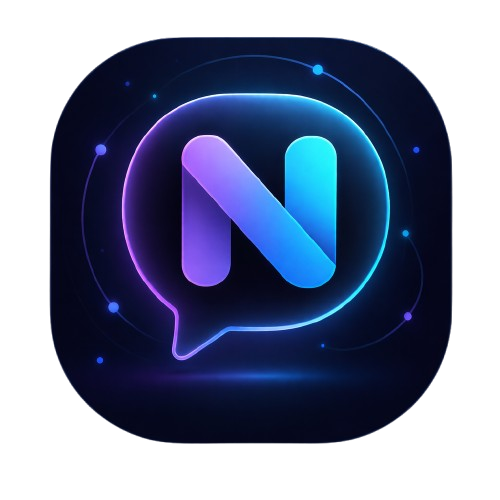
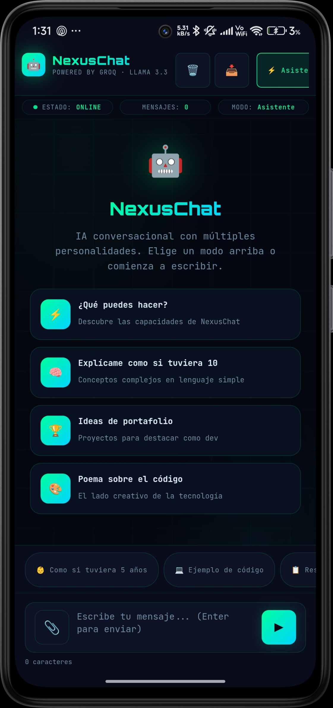
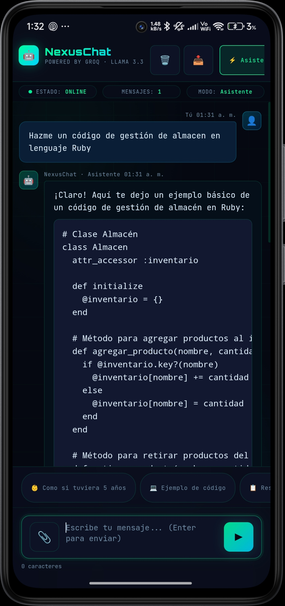
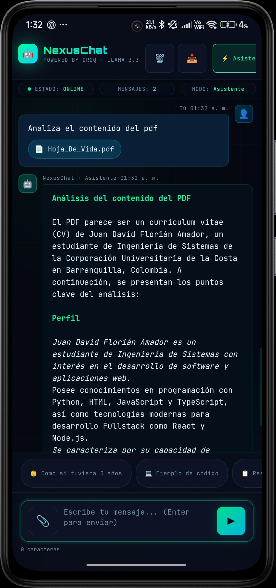

<div align="center">

# 🤖 NexusChat

**Interfaz de chat con IA, diseño hacker y 5 personalidades distintas.**  
Un solo archivo HTML. Sin instalación. Ábrelo y úsalo.

<br/>


<br/>

[](https://developer.mozilla.org/en-US/docs/Web/HTML)
[](https://groq.com/)
[](https://pages.github.com/)

</div>

---

## ✨ ¿Qué incluye?

- 🤖 **5 personalidades** — Asistente, Dev Expert, Coach, Filósofo y Creativo
- ⚡ **Streaming real** — las letras aparecen una a una con cursor animado
- 💬 **Comandos rápidos** — botones predefinidos para acelerar la conversación
- 📊 **Stats en vivo** — tokens, mensajes y modo activo en la barra superior
- 📥 **Exportar conversación** — en `.txt`, `.json` y `.md` con un clic
- 🎨 **Diseño terminal/hacker** — Orbitron + JetBrains Mono, neón verde/azul

---

## 🚀 Cómo usarlo

### 1. Obtén tu API Key de Groq

1. Crea una cuenta gratis en [console.groq.com](https://console.groq.com)
2. Ve a **API Keys** → **Create API Key**
3. Copia la key generada (empieza con `gsk_...`)

### 2. Intégrala en el proyecto

1. Descarga o clona este repositorio
2. Abre `index.html` con cualquier editor de texto (VS Code, Notepad++, etc.)
3. Ve a la **línea 483** y reemplaza el placeholder con tu key:

```js
// línea 483
const API_KEY = "gsk_TU_API_KEY_AQUI";
```

### 3. Abre y listo

Abre `index.html` directamente en tu navegador. No necesitas instalar nada.

> ⚠️ **Nunca subas tu API key a GitHub.** Si vas a publicar el proyecto, asegúrate de dejar el placeholder vacío antes de hacer `git push`.

---

## 🎬 Demo


---

## 🛠️ Hecho con

- HTML
- [Groq API](https://groq.com/) — inferencia ultrarrápida

---

---

## 📱 ¿La quieres en tu celular?

<div align="center">



<br/><br/>

Si quieres tener NexusChat directo en tu Android, aquí te dejo la APK lista para instalar. Sin Play Store, sin complicaciones — la descargas, la instalas y listo.

<br/>


&nbsp;&nbsp;

&nbsp;&nbsp;


<br/><br/>

[](https://github.com/JUXCHXX/Nexuschat/releases/download/v1.0.0/app-debug.apk)

<br/>

> ⚠️ Antes de instalar activa **"Instalar apps de fuentes desconocidas"** en los ajustes de tu Android.

</div>

## 📄 Licencia

MIT — libre para usar y modificar.