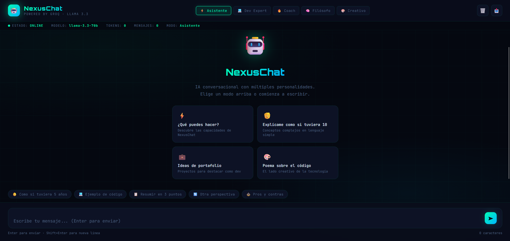

# 🤖 NexusChat

**Interfaz de chat con IA, diseño hacker y 5 personalidades distintas.**  
Un solo archivo HTML. Sin instalación. Ábrelo y úsalo.

---

## ✨ ¿Qué incluye?

- 🤖 **5 personalidades** — Asistente, Dev Expert, Coach, Filósofo y Creativo
- ⚡ **Streaming real** — las letras aparecen una a una con cursor animado
- 💬 **Comandos rápidos** — botones predefinidos para acelerar la conversación
- 📊 **Stats en vivo** — tokens, mensajes y modo activo en la barra superior
- 📥 **Exportar conversación** — en `.txt`, `.json` y `.md` con un clic
- 🎨 **Diseño terminal/hacker** — Orbitron + JetBrains Mono, neón verde/azul

---

## 🚀 Cómo usarlo

1. Clona o descarga el repositorio
2. Abre `index.html` directamente en tu navegador
3. ¡Listo!

> También disponible en **GitHub Pages**: [ver demo →](https://tu-usuario.github.io/nexus-chat)

---

## 🎬 Demo

---

## 🛠️ Hecho con

- HTML
- [Groq Cloude](https://groq.com/) de Anthropic

---

## 📄 Licencia

MIT — libre para usar y modificar.